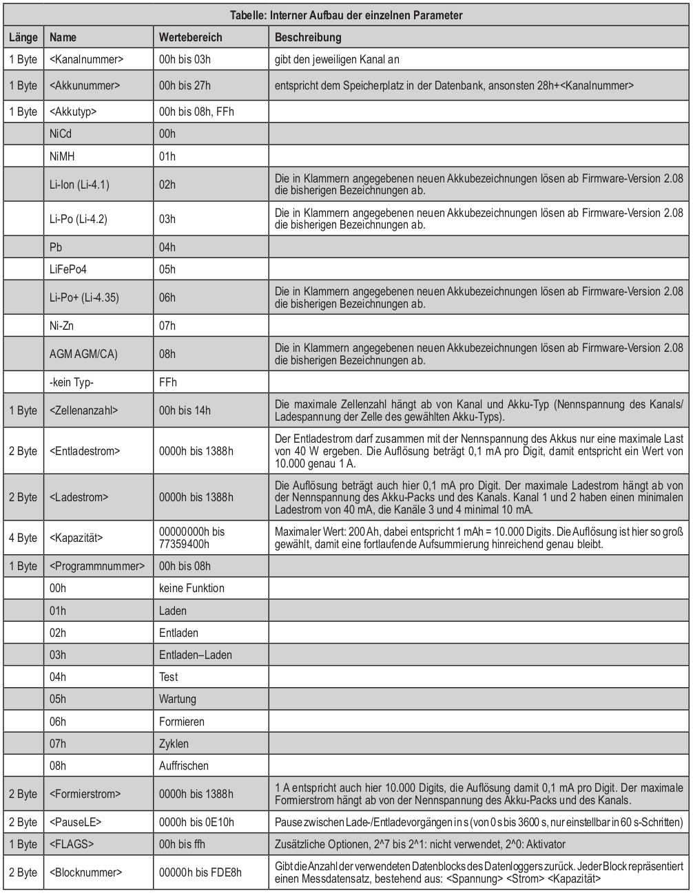
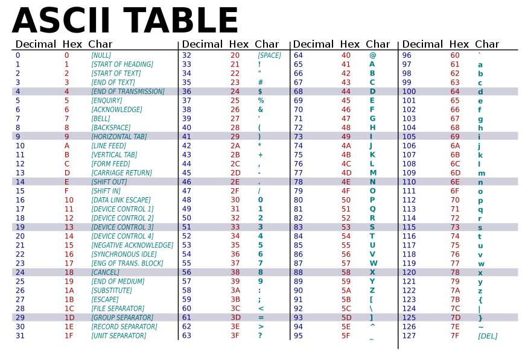
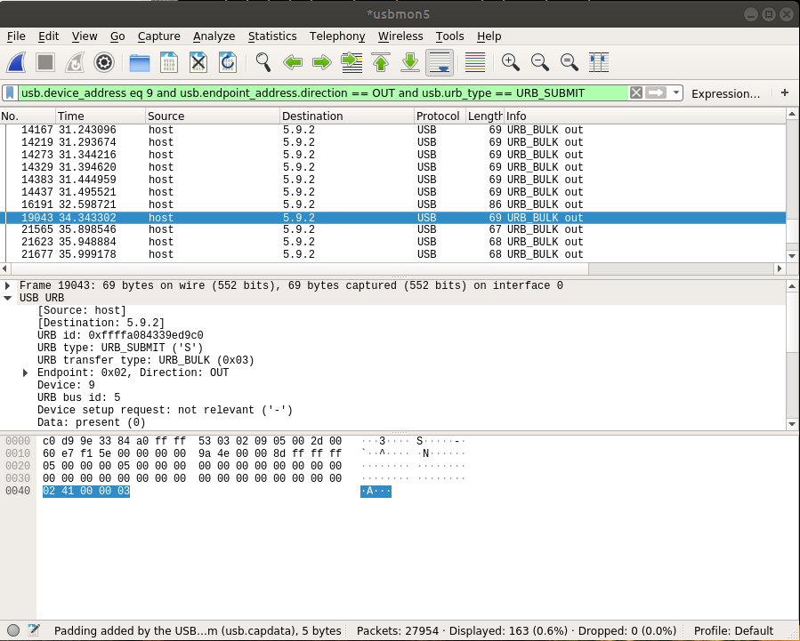
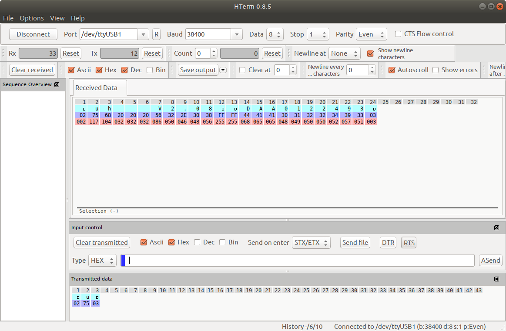

### ALC8500-2 Charge professional (ELV)
***
[Technical dictionary](https://www.dictindustry.de/deutsch-englisch)

```bash
apt-get install p7zip-rar
7z e Setup_ChargeProfessional.exe
apt-get install librxtx-java openjdk-11-jre # Java + Serial Java Library
usermod USERNAME -a -G dialout
java -jar ChargeProfessional-3.0.1.jar
```

### Protocol

[BSC or BSync](https://en.wikipedia.org/wiki/Binary_Synchronous_Communications)


```text
Baud: 38400, 1 Start, 1 Stopbit, 8 Databits, Even parity

Dataframe: <STX 0x02><data><ETX 0x03>
02/03/05 wird im dataframe durch 0x05 0x1[235] ersetzt!

Channel 02 = 0512 und 03 = 0513.
```

### Serial-USB send/receive and sniffing with wireshark

`apt-get -y install jpnevulator`

Using two terminals for communication with alc8500!

```bash
term01> jpnevulator --tty /dev/ttyUSB2:SB38400d --write

02700103
026d051203

term02> jpnevulator --tty /dev/ttyUSB2:SB38400d --read

02 70 01 28 01 01 2E E0 0F A0 00 7A 12 00 01 0F A0 00 00 00 BD 93 FA 03
02 6D 05 12 05 15 EC 00 09 00 00 00 00 03

# looking for alc8500

> cat /sys/kernel/debug/usb/devices|grep ALC -A 6 -B 4

T:  Bus=05 Lev=04 Prnt=06 Port=01 Cnt=01 Dev#=  9 Spd=12   MxCh= 0
D:  Ver= 1.10 Cls=00(>ifc ) Sub=00 Prot=00 MxPS= 8 #Cfgs=  1
P:  Vendor=0403 ProdID=f06e Rev= 2.00
S:  Manufacturer=ELV AG
S:  Product=ELV ALC8500 Expert
S:  SerialNumber=ELLPFUW8
C:* #Ifs= 1 Cfg#= 1 Atr=a0 MxPwr= 44mA
I:* If#= 0 Alt= 0 #EPs= 2 Cls=ff(vend.) Sub=ff Prot=ff Driver=ftdi_sio
E:  Ad=81(I) Atr=02(Bulk) MxPS=  64 Ivl=0ms
E:  Ad=02(O) Atr=02(Bulk) MxPS=  64 Ivl=0ms

> lsusb | grep 0403:f06e

Bus 005 Device 009: ID 0403:f06e Future Technology Devices International, Ltd

# using usbmon and wireshark:

modprobe usbmon

# wireshark filter for usbmon5:

usb.device_address eq 9 and usb.endpoint_address.direction == OUT and usb.urb_type == URB_SUBMIT
```

### ALC8500-2 Serial communication protocol function overview

#### Requests

chr | hex  | Function | Example
----|------|----------|-------------------------
 t  | 0x74 | Getting temperature | 02 74 03
 u  | 0x75 | Getting firmware and serial number | 02 75 03
 a  | 0x61 | Reading channel function | 02 61 00 03
 A  | 0x41 | Set channel function | 02 41 00 ... 03
 d  | 0x64 | Read database record | 02 64 00 00 03
 D  | 0x44 | Write database record | 02 44 00 00 ... 03
 L  | 0x4c | Delete channel logging | 02 4c 00 03
 b  | 0x62 | Getting log data at address | 02 62 00 00 ab 03
 i  | 0x69 | Getting channel logging indexes | 02 69 00 03
 m  | 0x6D | Getting channel measurement | 02 6d 00 03
 p  | 0x70 | Getting channel parameters | 02 70 00 03
 P  | 0x50 | Set channel parameter | 02 50 00 ... 03
 g  | 0x67 | Getting Additional parameter 0 | 02 67 03
 h  | 0x68 | Getting Additional parameter 1 | 02 68 03
 e  | 0x65 | Getting Additional parameter 2 | 02 65 03
 j  | 0x6a | Getting Additional parameter 3 | 02 6a 03
 z  | 0x7a | Getting Additional parameter 4 | 02 7a 03
 G  | 0x47 | Setting Additional parameter 0 | 02 47 ... 03
 H  | 0x48 | Setting Additional parameter 1 | 02 48 ... 03
 E  | 0x45 | Setting Additional parameter 2 | 02 45 ... 03
 J  | 0x4a | Setting Additional parameter 3 | 02 4a ... 03
 Z  | 0x5a | Setting Additional parameter 4 | 02 5a ... 03

#### Responses

#### u (0x6a 0x75) Firmware and serial number:

```text
           .           |           .           |           .           |
02 75 68 20 20 20 56 32 2E 30 38 FF FF 44 41 41 30 31 32 32 34 39 33 03
      |           |                    |
      |           |                    └── Serial number
      |           └── Firmware version
   u  └── h (104)
```

#### t (0x74) Temperature:

```text
02 74 AB E0 15 C8 0E CD 03
      |     |     |
      |     |     └── Cooler temperature
      |     └── Power supply temperature
   t  └── Sensor temperature (0xab 0xe0 = not connected)
```

#### d (0x64) Get battery database (40 records):

```text
           .           |           .           |           .           |
02 64 01 45 4E 45 38 30 30 20 20 20 01 01 00 7A 12 00 2E E0 0F A0 00 00 00 FA FF 03   # 2000mAh Accu
02 64 00 45 4E 45 32 30 30 30 20 20 01 01 01 31 2D 00 2E E0 21 34 00 00 00 FA FF 03   # 800mAh Accu
      |  |                          |  |  |           |     |     |     |  |  |
      |  |                          |  |  |           |     |     |     |  |  └── Function enable
      |  |                          |  |  |           |     |     |     |  └── Loading factor
      |  |                          |  |  |           |     |     |     └── FLAGS
      |  |                          |  |  |           |     |     └── Delay Charge/Discharge
      |  |                          |  |  |           |     └── Loading current
      |  |                          |  |  |           └── Discharge current
      |  |                          |  |  └── Capacity
      |  |                          |  └── Cells
      |  |                          └── Accu typ
      |  └── Accu name
   d  └── Accu nummer

```

#### D (0x44) Set battery database (40 records):

```text
           .           |           .           |           .           |
02 64 00 45 4E 45 32 30 30 30 20 20 01 01 01 31 2D 00 2E E0 21 34 00 00 00 FA FF 03
```

#### a (0x61) Reading channel function (s. Ladestufe):

```text
02 61 00 50 03   50 = Charge
02 61 00 2F 03   2F = Discharge
02 61 01 7A 03   7A = Trickle charge (Erhaltungsladung)
02 61 01 00 03   00 = Idle
      |  |
      |  └── Function
   a  └── Channel
```

|Range | Function | actual implemented
|-----------|------------|------
|0x00..0x0A | Idle | 0x00
|0x0B..0x2D | Delay/Wait |
|0x2E..0x37 | Discharge | 0x2F
|0x38..0x6E | Charge | 0x50
|0x6F..0xA0 | Trickle Charge | 0x7A
|0xA1..0xC8 | Discharge finished |
|0xC9..0xFF | Emergency shut-down |

#### A (0x41) Start/Stopp function:

```text
02 41 00 00 03   Starting function at channel 1
02 61 00 0C 03   < Response (Pause/Wait)

02 41 00 01 03   Stopping function at channel 1
02 61 00 00 03   < Response (Idle)
      |  |
      |  └── Function
   A  └── Channel
```

#### m (0x6d) Channel measurement:

```text
02 6D 00 05 E0 0F CD 00 85 F9 8D 03
02 6D 00 05 E0 0F 8F 00 93 DB 79 03
      |  |     |     |
      |  |     |     └── Capacity
      |  |     └── Current
      |  └── Voltage
   m  └── Channel
```

#### p (0x70) Getting channel parameters:

```text
           .           |           .           |           .           |
02 70 01 28 01 01 2E E0 21 34 01 31 2D 00 01 27 10 00 00 00 F3 FA FA 03    # Charge
02 70 02 0E 01 01 2E E0 21 34 01 31 2D 00 00 27 10 00 00 00 05 8A FA 03    # Idle
02 70 03 2B 01 01 27 10 21 34 01 31 2D 00 04 27 10 00 00 00 01 BE FA 03    # Trickle charge
      |  |  |  |  |     |     |           |  |     |     |  |     |
      |  |  |  |  |     |     |           |  |     |     |  |     └── Loading factor
      |  |  |  |  |     |     |           |  |     |     |  └── Measure end
      |  |  |  |  |     |     |           |  |     |     └── FLAGS
      |  |  |  |  |     |     |           |  |     └── Delay Charge/Discharge
      |  |  |  |  |     |     |           |  └── Forming current
      |  |  |  |  |     |     |           └── Program nummer
      |  |  |  |  |     |     └── Capacity
      |  |  |  |  |     └── Loading current
      |  |  |  |  └── Discharge current
      |  |  |  └── Cells
      |  |  └── Accu type
      |  └── Accu nummer
   p  └── Channel 01/02 und ! 05/12 und 05/13

# Measure end = last logging record
```

#### P (0x50) Setting channel parameters and start:

```text
           .           |           .           |           .           |
02 50 00 28 01 01 2E E0 21 34 01 31 2D 00 01 27 10 00 00 00 FA 03
      |  |  |  |  |     |     |           |  |     |     |  |
      |  |  |  |  |     |     |           |  |     |     |  └── Loading factor
      |  |  |  |  |     |     |           |  |     |     |
      |  |  |  |  |     |     |           |  |     |     └── FLAGS
      |  |  |  |  |     |     |           |  |     └── Delay Charge/Discharge
      |  |  |  |  |     |     |           |  └── Forming current
      |  |  |  |  |     |     |           └── Program nummer
      |  |  |  |  |     |     └── Capacity
      |  |  |  |  |     └── Loading current
      |  |  |  |  └── Discharge current
      |  |  |  └── Cell number
      |  |  └── Accu type
      |  └── Accu nummer
   P  └── Channel

02 41 00 00 03
      |  └── 00 = Start
   P  └── Channel
```

#### Getting additional system parameter (-> e,g,h,j,z) (0x65 0x67 0x68 0x6a 0x7a):

- Final discharge voltage (1mV per digit)
- Charge cut-off detection (%Diff-U is Value/100)
- Default break (min 0..60)
- Forming count
- Cycle count
- Loading voltage
- Voltage of trickle charge
- Storage voltage


```text
           .           |           .           |           .           |
02 67 03 84 03 E8 0B B8 0C 1C 07 08 0A 0A 0A 0A 05 05 05 05 05 28 14 03
      |     |     |     |     |     |  |  |  |  |  |  |  |  |  |  |
      |     |     |     |     |     |  |  |  |  |  |  |  |  |  |  └── Charge cut-off detection NiMH
      |     |     |     |     |     |  |  |  |  |  |  |  |  |  └── Charge cut-off detection NiCd
      |     |     |     |     |     |  |  |  |  |  |  |  |  |
      |     |     |     |     |     |  |  |  |  |  |  |  |  └── Default break Pb
      |     |     |     |     |     |  |  |  |  |  |  |  └── Default break Li-Pol
      |     |     |     |     |     |  |  |  |  |  |  └── Default break Li-Ion
      |     |     |     |     |     |  |  |  |  |  └── Default break NiMH
      |     |     |     |     |     |  |  |  |  └── Default break NiCD
      |     |     |     |     |     |  |  |  |
      |     |     |     |     |     |  |  |  └── Cycle count forming NiMH
      |     |     |     |     |     |  |  └── Cycle count forming NiCd
      |     |     |     |     |     |  └── Cycle count NiMH
      |     |     |     |     |     └── Cycle count NiCd
      |     |     |     |     |
      |     |     |     |     └── Final discharge voltage Pb
      |     |     |     └── Final discharge voltage Li-Po
      |     |     └── Final discharge voltage Li-Ion
      |     └── Final discharge voltage NiMH
   g  └── Final discharge voltage NiCd

           .           |           .           |           .           |
02 68 05 DC 05 DC 05 DC 05 DC 10 04 0F D2 10 68 10 36 09 38 08 D4 2A F8 03
      |                       |     |     |     |     |     |     |
      |                       |     |     |     |     |     |     └── LowBat cut off ALC8500 (not used)
      |                       |     |     |     |     |     └── Voltage of trickle charge Pb
      |                       |     |     |     |     └── Loading voltage Pb
      |                       |     |     |     └── Voltage of trickle charge Li-Pol
      |                       |     |     └── Loading voltage Li-Pol
      |                       |     └── Voltage of trickle charge Li-Ion
      |                       └── Loading voltage Li-Ion
   h  └── Never change !

              .           |           .           |           .
02 65 0C 1C 05 10 FE 10 36 05 78 05 07 6C 06 72 07 3A 05 09 92 08 D4 03
      |     |  |     |     |     |  |     |     |     |  |     |  
      |     |  |     |     |     |  |     |     |     |  |     └── Voltage of trickle charge AGM
      |     |  |     |     |     |  |     |     |     |  └── Loading voltage AGM
      |     |  |     |     |     |  |     |     |     └── Default break AGM
      |     |  |     |     |     |  |     |     └── Final discharge voltage AGM
      |     |  |     |     |     |  |     └── Voltage of trickle charge NiZn
      |     |  |     |     |     |  └── Loading voltage NiZn
      |     |  |     |     |     └── Default break NiZn
      |     |  |     |     └── Final discharge voltage NiZn
      |     |  |     └── Voltage of trickle charge LiPo+
      |     |  └── Loading voltage LiPo+
      |     └── Default break LiPo+
   e  └── Final discharge voltage LiPo+

           .           |           .
02 6A 08 FC 05 0E 10 0D 7A 00 0B 0C 03
      |     |  |     |     |  |  |
      |     |  |     |     |  |  |
      |     |  |     |     |  |  └── ALC Display Contrast 0..15
      |     |  |     |     |  └── ALC-Configuration
      |     |  |     |     └── n.v.
      |     |  |     └──
      |     |  └── Loading voltage LiFePo4
      |     └── Default break LiFePo4
   j  └── Charge cut-off detection LiFePo4

ALC-Config Coding:
  Display Mask 0x07:
    0=Aus, 1=An, 2=1min, 3=5min, 4=10min, 5=30min, 6=60min,
    08h=ALBEEP_EN, 10h=BUBEEP_EN

           .           |
02 7A 0E 10 0E 74 0E 74 06 C2 03
      |     |     |     |
      |     |     |     └── Storage voltage NiZn
      |     |     └── Storage voltage LiPol+
      |     └── Storage voltage  Li-Pol
   z  └── Storage voltage Li-Ion
```
#### Setting additional system parameter (-> g,h,j,e,z) (0x67 0x68 0x6a 0x65 0x7a):

```text
              .           |           .           |           .
02 47 03 84 03 E8 0B B8 0C 1C 07 08 0A 0A 0A 0A 05 05 05 05 05 28 14 03
02 48 05 DC 05 DC 05 DC 05 DC 10 04 0F D2 10 68 10 36 09 38 08 D4 2A F8 03
02 4A 08 FC 05 0E 10 0D 7A 00 0B 0C 03
02 45 0C 1C 05 10 FE 10 36 05 78 05 07 6C 06 72 07 3A 05 09 92 08 D4 03
02 5A 0E 10 0E 74 0E 74 06 C2 03

```

### Logging

#### p (0x70) Getting measure end

Measure end / 100 = datablock count

```text
              .           |           .           |           .
02 70 00 28 00 06 8C A0 1B 58 00 6A CF C0 01 0D AC 00 3C 00 00 A4 78 03 # Messende = 0x00A4 = 164
02 70 00 28 01 06 AD 70 9C 40 02 62 5A 00 01 4E 20 01 2C 00 01 FC 78 03 # Record end = 0x01FC = 508
```

#### i (0x69) Getting channel datalogger indexes (Example channel 0)

Crazy usage of indexes and address:

```text
0: Log 1 Starts at 0x0000 and ends at index position 0 = 0x00A4
1: Log 2 Starts at 0x00A4 and ends at index position 1 = 0x00D9
   and write previous end at position <last> (0x00A4)

.. and so on ..


        |last | end | 00  | 01  | 02  | 03  | 04  | 05  | 06  | 07  | 08  | 09  |   # 10 Logging records / channel
02 69 00 FF FF 00 00 FF FF FF FF FF FF FF FF FF FF FF FF FF FF FF FF FF FF FF FF 03 # no entries
02 69 00 00 00 00 00 00 A4 FF FF FF FF FF FF FF FF FF FF FF FF FF FF FF FF FF FF 03 # first logging
02 69 00 00 A4 00 00 00 A4 00 D9 FF FF FF FF FF FF FF FF FF FF FF FF FF FF FF FF 03 # second
         ^           |
         |           |
         +-----------+

9: Log 11 begins at 0x2B6E, write the last record at last and end at position <end>
   If <end> != 0000 index 9+ was written.

           +-----------------------------------------------------------------+
           |   <end>                                                         |
           |     |                                                           |
           v     v                                                           ^
02 69 00|2B 6E|2B DC|00 A4|00 D9|01 FC|03 C2|03 C9|0B F9|14 4B|16 04|16 0F|2B 6E|03
      |   |    |     |     |     |     |     |     |     |     |     |     |
      |   |    |     |     |     |     |     |     |     |     |     |     └─ 11118
      |   |    |     |     |     |     |     |     |     |     |     └─ 5647
      |   |    |     |     |     |     |     |     |     |     └─ 5636
      |   |    |     |     |     |     |     |     |     └─ 5195
      |   |    |     |     |     |     |     |     └─ 3065
      |   |    |     |     |     |     |     └─ 969
      |   |    |     |     |     |     └─ 962
      |   |    |     |     |     |
      |   |    |     |     |     └─ 508
      |   |    |     |     └─ 217
      |   |    |     └─ 164
      |   |    └─ end if index 09 in use (11228)
      |   └─ last start address (index 00-09)
   i  └── channel

# If a 12th time is logged, the index from below is overwritten again,
# Index 00 -> 0x35E5. The end of index 9 in end is written after last as start value.
# is written. Measurement 11 starts at last and goes to index 00.

        |last | end | 00  | 01  | 02  | 03  | 04  | 05  | 06  | 07  | 08  | 09  |
02 69 00 2B DC 2B DC 35 E5 00 D9 01 FC 03 C2 03 C9 0B F9 14 4B 16 04 16 0F 2B 6E 03

# At the 13th measurement index 01 is written with the new end. The last start value
# <last> is set to the value from index 00. End remains as end marker for index 09
# remains.

        |last | end | 00  | 01  | 02  | 03  | 04  | 05  | 06  | 07  | 08  | 09  |
02 69 00 35 E5 2B DC 35 E5 36 8E 01 FC 03 C2 03 C9 0B F9 14 4B 16 04 16 0F 2B 6E 03

# When reading, the index with the missing predecessor index is simply ignored.
# <End> actually marks the end of index 0x10. Thus the missing begin
# to position 02 can be ignored.
```

#### b (0x62) Getting battery data at log address

The start of a measurement series starts with 3 data fields where the measured values are replaced by battery characteristic values:

- Field 1: Battery no., function, clock_sec, clock_min, clock_hd, clock_day, clock_mon, clock_year
- Field 2: Battery type, cell count, capacity, charge current
- Field 3: Battery type, cell count, discharge current, forming current, pauseLE

```text
02 62 00 00 d9 03
02 62 00 00 D9 28 01 00 00 00 00 00 00 01 06 02 62 5A 00 9C 40 01 06 AD 70 4E 20 01 2C 03

02 62|00 14 4b|03
02 62|00 14 4b|28 01 00 00 00 00 00 00|01 06 00 b7 1b 00 27 10|01 06 2e e0 17 70 00 00 03
      |  |     |  |  |                 |  |  |           |     |  |  |     |     |    
      |  |     |  |  |                 |  |  |           |     |  |  |     |     └─ PauseLE
      |  |     |  |  |                 |  |  |           |     |  |  |     └─ Form current
      |  |     |  |  |                 |  |  |           |     |  |  └─ Discharge current
      |  |     |  |  |                 |  |  |           |     |  └─ Cells
      |  |     |  |  |                 |  |  |           |     └─ Accu Typ
      |  |     |  |  |                 |  |  |           └─ Current
      |  |     |  |  |                 |  |  └─ Capacity
      |  |     |  |  |                 |  └─ Cells
      |  |     |  |  |                 └─ Accu Typ
      |  |     |  |  └─ SS MM HH DD MM YY
      |  |     |  └── Function
      |  |     └── Accu number
      |  └── Block address
   b  └── Channel
```

These 3 data fields are identical with the data at data block 0

```text
              .           |           .           |           .           |           .
02 62 00 00 A4 28 01 00 00 00 00 00 00 00 06 00 6A CF C0 1B 58 00 06 8C A0 0D AC 00 3C 03

02 76 00 00 00 28 01 00 00 00 00 00 00 00 06 00 6A CF C0 1B 58 00 06 8C A0 0D AC 00 3C
1E B5 00 .. # <- Messwerte
```

#### v (0x76) Getting logging measure values at block

Logging measured values can only be read block by block.
To read the values 99 - 101, therefore, 2 blocks of 100 values must be read, block 00 and 01!
The actual values are read via the index. At the index position is the last value,
the start value is the previous index value.

Response: \<Voltage\> \<Current\> \<Capacity\>

```text
        |last | end | 00  | 01  | 02  | 03  | 04  | 05  | 06  | 07  | 08  | 09  |
02 69 00|0B F9|00 00|00 A4|00 D9|01 FC|03 C2|03 C9|0B F9|14 4B|FF FF|FF FF|FF FF|03:

Index 0:  159 values, Start:   3 End: 163 -> 02 76 00 00 00 03 ... 02 76 00 00 01 03 ( 2 blocks)
Index 1:   48 values, Start: 167 End: 216 -> 02 76 00 00 01 03 ... 02 76 00 00 02 03 ( 2 blocks)
Index 2:  286 values, Start: 220 End: 507 -> 02 76 00 00 02 03 ... 02 76 00 00 05 03 ( 4 blocks)
Index 3:  449 values, Start: 511 End: 961 -> 02 76 00 00 05 03 ... 02 76 00 00 09 03 ( 5 blocks)
Index 4:    2 values, Start: 965 End: 968 -> 02 76 00 00 09 03                       ( 1 block)
Index 5: 2091 values, Start: 972 End:3064 -> 02 76 00 00 09 03 ... 02 76 00 00 1d 03 (22 blocks)
Index 6: 2126 values, Start:3068 End:5195 -> 02 76 00 00 1e 03 ... 02 76 00 00 33 03 (22 blocks)

  a4 -   0 =  a4 (164)
  d9 -  a4 =  35  (53)
 1fc -  d9 = 123 (291)
 3c2 - 1fc = 1c6 (454)
 3c9 - 3c2 =   7
 bf9 - 3c9 = 830 (2096)
144b - bf9 = 852 (2130)

02 76 00 00 02 03
      |  |
      |  └── Datablock
   t  └── Channel

02 76 00 00 02
23 24 1B 5A 00 03 DC 0A
23 1F 1B 57 00 03 FE 3A
23 1A 1B 5A 00 04 20 66
23 14 1B 5C 00 04 42 96
23 0F 1B 57 00 04 64 C9
23 09 1B 57 00 04 86 F5
23 02 1B 5C 00 04 A9 21
22 FE 1B 59 00 04 CB 54
22 F5 1B 59 00 04 ED 83
22 EF 1B 57 00 05 0F B2
22 EB 1B 5A 00 05 31 DE
22 E3 1B 5A 00 05 54 0E
22 DC 1B 57 00 05 76 3E
22 D6 1B 59 00 05 98 6A
|     |     |
|     |     └── Capacity
|     └── Current
└── Voltage
```

#### L (0x4C) Delete channel logging:

```text
02 4C 00 03
      |
   L  └── Channel

# response:
02 6C 00 03
02 6C 01 03
```

#### Error response (End of TX):

```text
02 04 03
```

#### Data Specification






#### Wireshark example



#### HTerm configuration and example

Send only 75 to getting firmware/serial.



[ALC8500 Dialoge](./gfx/README.md)
